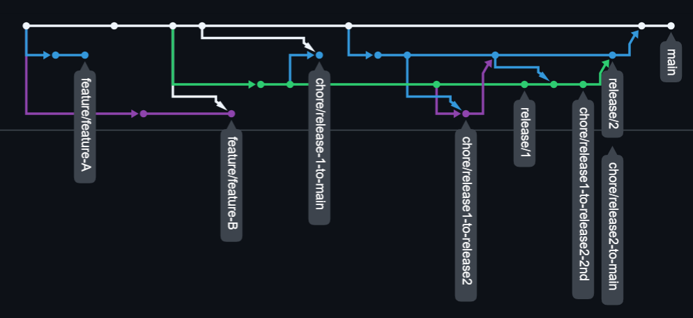

# Multi version/release branching explained

## Intro

This text explains our opininionated approach we use while working on project where we need to maintain multiple versions/releases of software at the same time.
However the most important message is valid also for project that needs to work only with 2 versions (production and development).

Furthermore we will explain differences between squash-merge and "simple" merge and when it is good to use which one.

## TL-DR

Here is short summary how we use git:

> Squash-merge feature or hotfix into oldest release branch and simple up-merge changes to newer release branches (and main/development branch)

We know that there are other approaches (like rebase etc.) and also in our company there different opinions (e.g. don't use squash at all). But if you are interested in more details - check out (pun intended) next section or just skip to conclusion.

## (Almost) real life example

Here we show example "what" could happend in real like world.

### 1. Work on feature A and B is started

Both are planned for release 1

### 2. Feature A is squash-merged

Using feature branches is no-brainer these days. Usually there are multiple commits - even small changes might require another commit after review. 

But to keep history on main/release branches clear - we squash the feature during the merge.

### 3. Release 1 branch is started

Although feature B is not yey finished, we are starting release 1 branch. This can allow early integration with other sub-systems or just allows us to start developing future features which shall not be a part of release 1.

### 4. Feature C is already merged into main.

Rest of our team has already (squash-) merged smaller feature C into main.

### 5. Feature B is squash-merged into release 1

Since feature B (but could be also hotfix from integration) is merged into release 1 branch after conflict was resolved (typical concurrent development conflict)

```bash
sodik@actopus:~/projects/PLAYGROUND/multi-version-branching-test (feature/feature-B)$ git merge release/1
Auto-merging src/controller.txt
CONFLICT (content): Merge conflict in src/controller.txt
Automatic merge failed; fix conflicts and then commit the result.
```

### 6. We need to merge changes from release 1 to main

But we have conflict (with feature C) again. We create chore branch since we don't want to merge directly into main branch. That way we can resolve conflicts and still let CI check our code before merge into main.

We resolve conflicts on chore branch and once CI passed, we **squash-merge** it to main (carefull reader notice that this is not according to our strategy - we just want to demonstrate why it is a **bad** thing).

### 7. Release 2 branch was started

### 8. Hotfix from integration was fixed in release 1 branch

Luckily it was in service not changed in-between

### 9. We want to merge release 1 to release 2 (and later to main)

But there are still conflicts we already resolved!

```bash
sodik@actopus:~/projects/PLAYGROUND/multi-version-branching-test (chore/release1-to-release2)$ git merge release/2
Auto-merging README.md
CONFLICT (content): Merge conflict in README.md
Auto-merging src/cheese-service.txt
CONFLICT (add/add): Merge conflict in src/cheese-service.txt
Auto-merging src/controller.txt
CONFLICT (content): Merge conflict in src/controller.txt
Automatic merge failed; fix conflicts and then commit the result.
```

After resolve we see there are actually no real changes but git doesn't resolve them automatically.

```
diff --cc src/cheese-service.txt
index 29714a5,8dcc56d..0000000
--- a/src/cheese-service.txt
+++ b/src/cheese-service.txt
diff --cc src/controller.txt
index 1bea2b2,e057763..0000000
--- a/src/controller.txt
+++ b/src/controller.txt
```

This time we wan't do squash - just **simple merge** (as per our strategy)

### 10. Hotfix 2 was done on release 1

### 11. We start another up-merge branch

There are conflicts - but git can resolve them automatically now

```bash
sodik@actopus:~/projects/PLAYGROUND/multi-version-branching-test (chore/release1-to-release2-2nd)$ git merge release/2
Merge made by the 'ort' strategy.
 README.md             | 17 +++++++++++++++++
 src/controller.txt    |  4 ++++
 src/peace-service.txt |  7 +++++++
 src/world-service.txt |  2 +-
 4 files changed, 29 insertions(+), 1 deletion(-)
 create mode 100644 src/peace-service.txt
```

This is exactly what we wanted - do not resolve same conflicts everytime merging into "higher" release. This can be really annoying if you have to support multiple versions (in our case it is not uncommon to have 4 active versions somewhere in the world).

## Why it works now?

Natural question - why squash merge harms git ability to resolve conflicts.

Here you can see network graph of git commits for our example. For simple merge, the commit has two parents (as we see later on), but squash commits have not.



It also make sense, that our effort to resolve conflict is "hidden" with other changes when squashed - thus git can't use this as guidenance to resolve conflict later on.

## Conclusion

In our opinionated approach - we use squashing for feature branches, we once merged, we don't have to deal with that branch anymore - to keep history cleaner.

However when dealing with release branches, we "simply" merge them up, so that git remembers how to resolve conflicts. And it has also benefit, that if we ever forget to merge some fix into higher version, it will be merged with next up-merge. 

We don't claim that this approach avoid any conflicts, we just have to resolve them once and then git will help us to resolve the conflicts next time.
